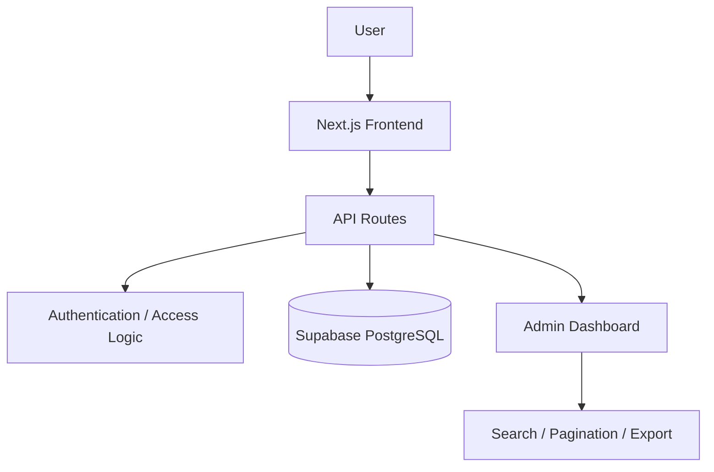

# ai-learning-platform-case-study

## Repo Purpose

A sanitized case study exploring a cloud-hosted learning platform concept: onboarding, wallet-based access concepts, structured learning paths, lesson progress, quizzes, and certificate eligibility, with an admin analytics layer.

## What This Application Demonstrates

This project demonstrates end-to-end platform thinking for a learning product: relational schema design for progress tracking, API route planning around a resource-oriented structure, protected access logic, and admin-facing analytics reporting.

## Tools / Concepts Used

- Next.js (frontend + API routes)
- Supabase PostgreSQL (schema design, RLS concepts)
- Vercel (deployment concepts)
- GitHub (version control)
- Cursor + Claude (AI-assisted development)
- ChatGPT (architecture planning, documentation)

## Architecture Overview

The application is modeled as a standard three-tier structure: a Next.js frontend, a set of resource-oriented API routes, and a Supabase PostgreSQL data layer. Access to lesson content and progress endpoints is gated by session-based authentication, with a separate admin tier for analytics.



## Key Features

- Learning paths
- Lessons
- Quiz attempts
- Progress tracking
- User profile
- Certificate eligibility
- Admin analytics
- Protected access logic

## Folder Structure

```
ai-learning-platform-case-study/
├── README.md
├── docs/
│   ├── architecture.md
│   ├── database-schema.md
│   ├── api-routes.md
│   ├── dashboard-features.md
│   ├── security-notes.md
│   ├── lessons-learned.md
│   └── interview-talk-track.md
├── diagrams/
│   ├── system-overview.md
│   └── data-flow.md
├── sql/
│   └── example-schema.sql
├── api/
│   └── route-examples.md
└── screenshots/
    └── README.md
```

## Disclaimer

> This schema is a sanitized learning version based on independent development work. It does not contain production data, private credentials, proprietary logic, or real customer records.

## Interview Positioning

Positioned as a reference implementation for platform-style thinking on a consumer learning product: how to model progress and certification data relationally, how to expose it safely through an API, and how to give admins visibility without exposing raw user data.
