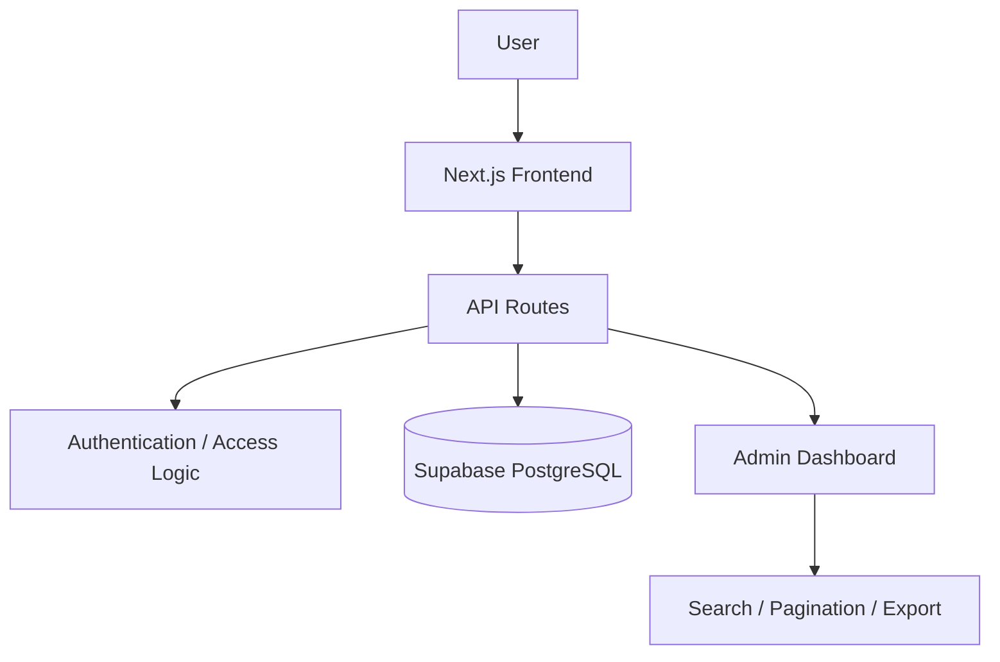

# Architecture — ai-learning-platform-case-study

## Overview

This case study models a learning platform where users move through learning paths made of lessons, track progress, attempt quizzes, and become eligible for certificates once completion criteria are met.

## System Layers

- **Frontend**: Next.js application handling routing, forms, and client state.
- **API Layer**: Next.js API routes acting as the service boundary between frontend and data layer.
- **Auth / Access Logic**: Middleware and route guards enforcing session and role-based access.
- **Data Layer**: Supabase PostgreSQL, modeled with normalized tables and row-level security concepts.
- **Admin Layer**: Reporting and management views with search, pagination, and export.

## Design Decisions

- Chose a relational schema over a document store because access patterns are relationship-heavy (users to records, records to audit trail).
- API routes are grouped by domain resource rather than by page, so the service boundary would survive a frontend framework change.
- Admin surfaces are treated as a distinct access tier rather than an extension of user-facing routes.

## Disclaimer

> This schema is a sanitized learning version based on independent development work. It does not contain production data, private credentials, proprietary logic, or real customer records.
